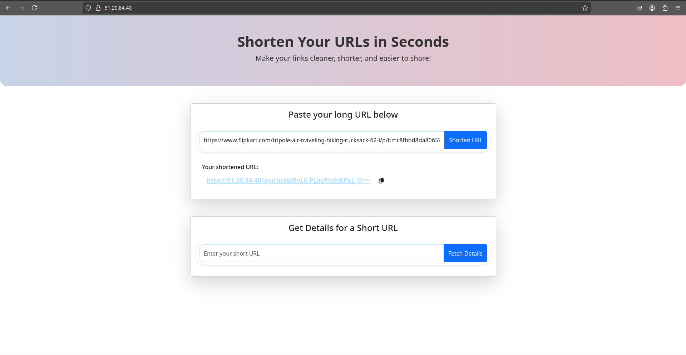
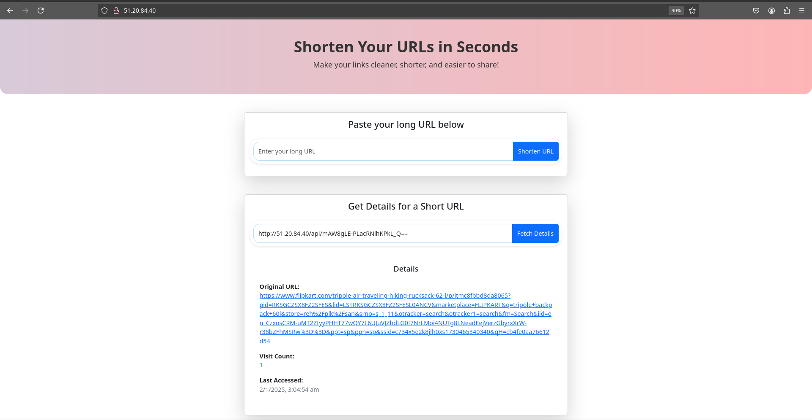

# Table of Contents
- [Table of Contents](#table-of-contents)
  - [System Design](#system-design)
    - [Frontend](#frontend)
    - [Backend](#backend)
    - [Load Balancing \& Rate Limiting](#load-balancing--rate-limiting)
    - [Database (NoSQL)](#database-nosql)
  - [How to run](#how-to-run)
  - [Notes](#notes)

## System Design
### Frontend
- React based application with 2 components
  - URL Shortener: Handles URL creation and shortening functionalities.
  
  - URL Stats: Provides analytics and statistics for shortened URLs.
  
### Backend
- Python-Flask based API that is utilised by the frontend client.
- The backend is deployed on AWS using Gunicorn to ensure scalability and enhanced performance
- A `run_local.sh` script is provided for local testing and debugging purposes.

### Load Balancing & Rate Limiting
- Reverse Proxy: NGINX is used as a reverse proxy to route requests to the URL-shortening services.
- Rate Limiting: Configured within NGINX to mitigate DoS attacks and ensure system reliability under load

### Database (NoSQL)
- Locks in MongoDB are at document level which enables high volume of concurrent writes.
- URL Info and stats are contained within the same document.

## How to run
- To run locally, you need to update two config variables namely `WORK_DIR` and `ENV_DIR`. The values for these variables are expecteed to be absolute paths.
- Backend config:
  - rename the file `settings-copy.py` to `settings.py`
  - Update your mongodb credentials in this file
- Frontend config:
  - rename the file `.env.copy` to `.env`
  - Set the route of our backend api for the shortening service under `REACT_APP_SHORTEN_ENDPOINT`
  - Note: In case the service is accessible by the same domain as the frontend service, the config variable can be the root path without domain info.

## Notes
- Frontend and backend build/deploy scripts for the frontend and backend can be separated if needed, though they remain combined for simplicity in this assignment.
- Deployed tool is accessed via the server's IP address due to the absence of DNS configuration.
- Since the deployment is not via a DNS and SSL Security, the _copyToClipboard_ functionality won't work. It can be tested on localhost.